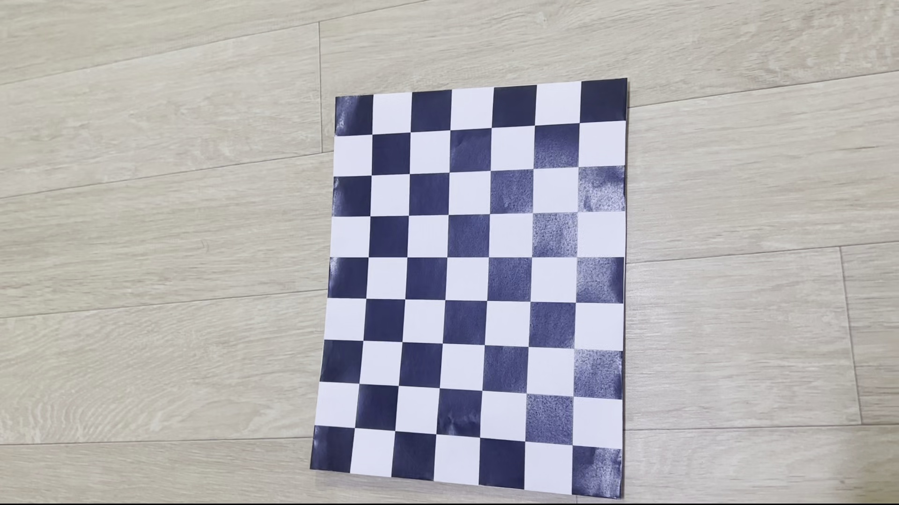
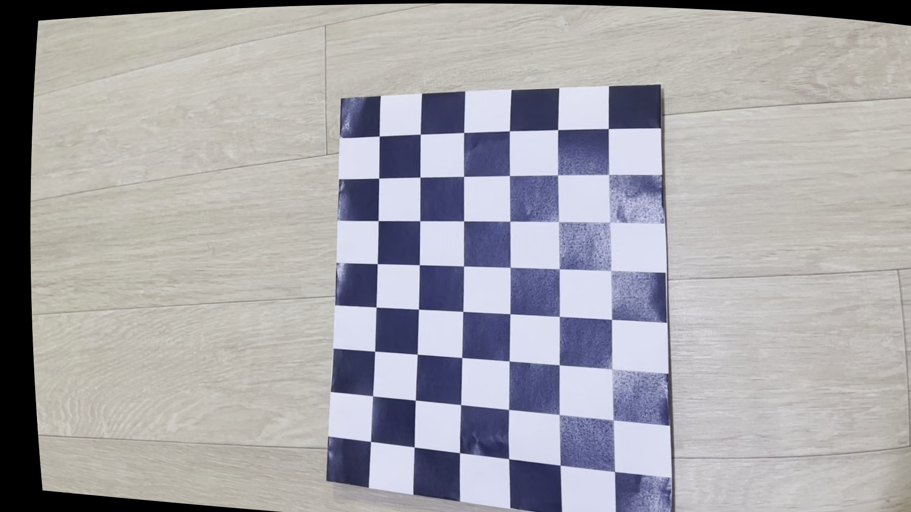

# Camera Calibration Assignment

## 1. Camera Calibration 

- 체스보드 사이즈: **(7, 5)**  
- 총 프레임 수: **681**
- 체스보드 인식 성공 프레임 수: **278**

### Intrinsic Parameters (Camera Matrix)

```
[[1.95949270e+03 0.00000000e+00 5.56720408e+02]
 [0.00000000e+00 1.84237399e+03 4.37564010e+02]
 [0.00000000e+00 0.00000000e+00 1.00000000e+00]]
```

- **fx** = 1959.49  
- **fy** = 1842.37  
- **cx** = 556.72  
- **cy** = 437.56  

### Distortion Coefficients

```
[ 0.2785417   0.38471694 -0.02475514 -0.13305862 -0.89482082 ]
```

### Reprojection RMSE

- **RMSE** = 0.4484

---

## 2. Lens Distortion Correction

- 카메라 캘리브레이션 결과를 이용해 왜곡 보정 수행
- 체스보드 이미지 및 전체 동영상에 대해 렌즈 왜곡 보정 적용

### 결과 이미지

- 보정 전: `original_frame.jpg`  
- 보정 후: `undistorted_frame.jpg`

### 결과 영상

- 보정된 영상: `undistorted_output.avi`

---

## 참고 사항

- 사용한 체스보드 영상: `IMG_5370.MOV`
- 파이썬 코드: `com.py` (캘리브레이션 수행 및 보정 영상 저장 통합)

```

---

원하면 README에 **이미지 포함**도 가능해요:

```markdown
### Before and After

| Before | After |
|--------|-------|
|  |  |
```
